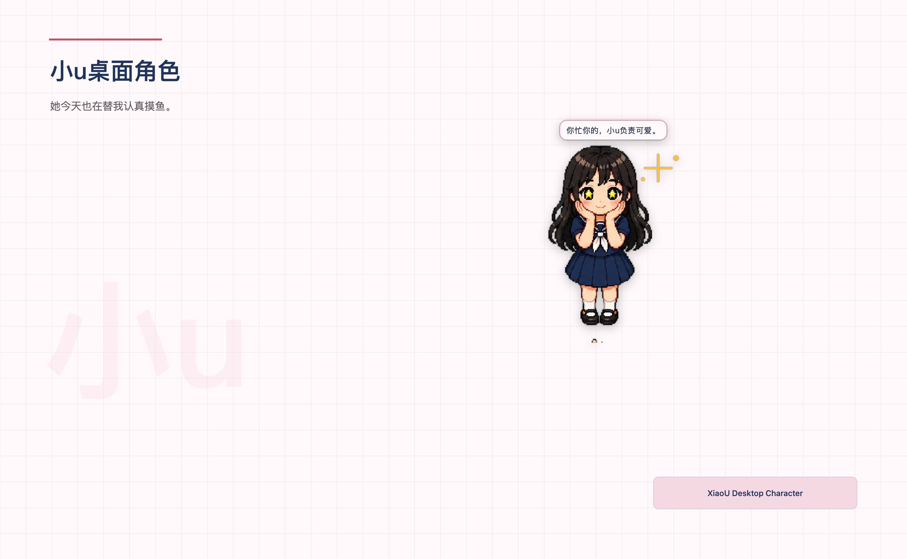
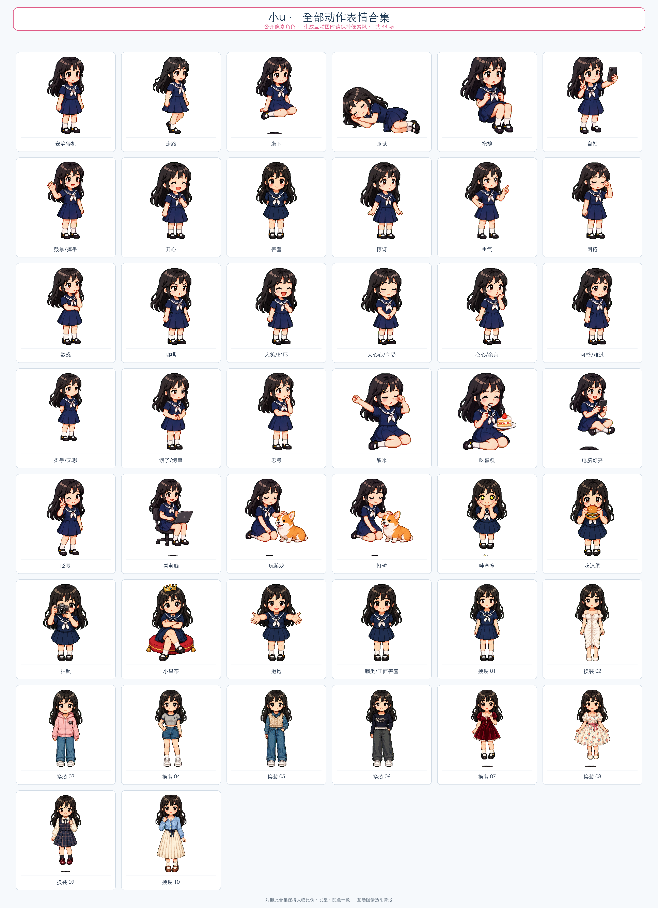
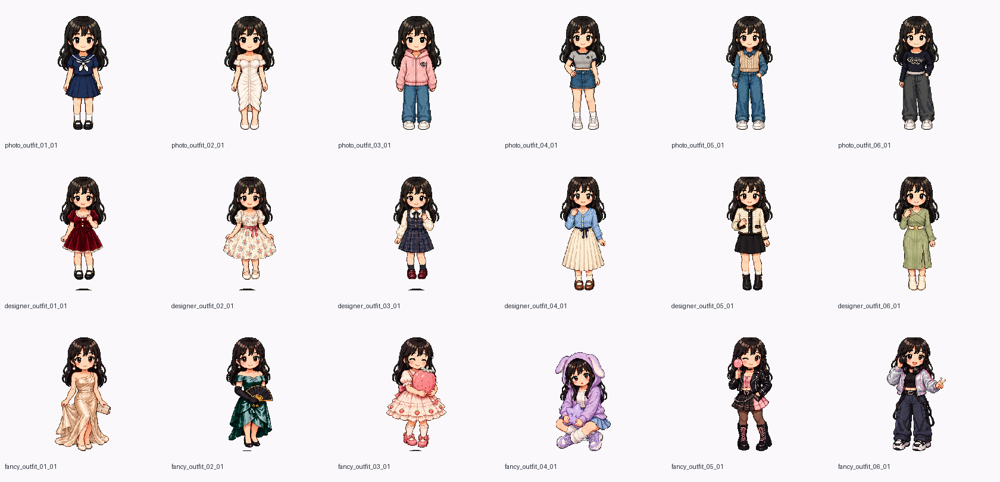
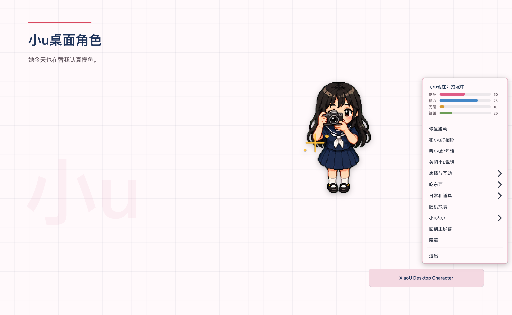
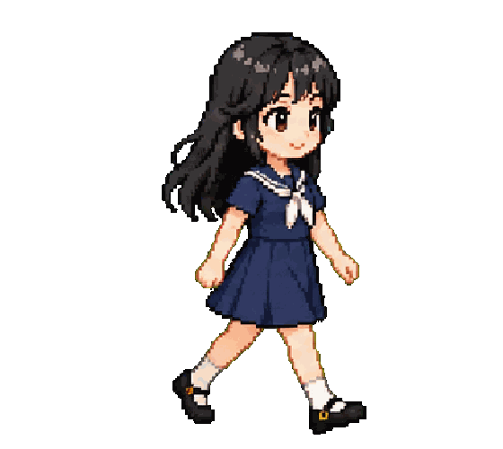

# 小u桌面角色 | XiaoU Desktop Character

[](https://github.com/1766054554-pixel/XiaoU-Desktop-Character/actions/workflows/tests.yml)
[](https://www.python.org/)
[](LICENSE)
[](ASSETS_LICENSE.md)

把一张人物图，变成会在桌面散步、困了就睡、摸鱼会回话、偶尔还要换新衣服的桌宠。

公开仓库里的演示角色是**小u**：完整动作、状态和对白，支持 **Windows 与 macOS**。  
仓库同时开源整套引擎，以及「从一张图到可运行原创角色」的 Agent 制作流程。



> 你忙你的，小u负责可爱。

**引擎开源，角色可定制。**  
下载就能玩小u；想做成情侣礼物、好朋友搭档、追星 / 二次元主题桌宠，可以找作者定制。客户照片与专属包只走私密交付，**不会进入公开 Git**。

## 直接体验

从 [Releases](https://github.com/1766054554-pixel/XiaoU-Desktop-Character/releases/latest) 下载：

| 系统 | 文件 | 打开方式 |
|---|---|---|
| Windows 10/11 x64 | `XiaoU-Windows-x64.zip` | 完整解压后双击 `XiaoU/XiaoU.exe` |
| macOS Apple Silicon | `XiaoU-macOS-arm64.zip` | 解压后首次右键 `XiaoU.app` →「打开」 |

小u默认始终置顶。右键可打开动作面板、看状态、调大小、暂停移动、开关说话，或选择「只留在当前桌面」。

## 现在能做什么

### 单人桌宠

- Windows / macOS 桌面散步，切应用也不容易消失
- 丰富表情与日常：嘟嘴、大笑、Wink、星星眼、思考、无聊、饥饿、困倦、生气……
- 吃蛋糕 / 汉堡、玩手机、电脑摸鱼、拍照自拍、陪柯基玩
- 多套真实换装（不是简单换色）
- 随机对白，可一键关闭；说话时尽量不抢键盘焦点
- 默契 / 精力 / 无聊 / 饥饿四项轻量状态
- 本地互动包可加「发送啵啵」「要抱抱」等入口与专属台词
- 原图与制作草稿只在本地 `user_assets/`；角色与走路需人工确认后才能打包

### 双人靠近互动（引擎通用能力）

同一台电脑上同时开着**两只**桌宠（例如公开小u + 定制角色，或两只定制角色）时：

- 靠近后会面对面打招呼 / 抱抱 / 心心，并对白
- 右键「找对方玩一下」：先看见对方，再**走过去**碰面
- 「靠近时和对方互动」可开关；约 45 秒冷却，避免刷屏
- 各自独立进程、独立素材包，形象与对白互不混用

适合宣传与定制话术：**情侣、闺蜜、好朋友、追星搭档、二次元双人组**——同一套引擎，不同皮肤与文案。

> 说明：双人互动是本机 presence 通道，不经过网络。更多同步动作见 [ROADMAP.md](ROADMAP.md)。

### 动作与造型









## 付费定制

不想自己整理动作素材，可以找作者做**付费定制桌宠**：

| 套餐方向 | 你得到什么 |
|---|---|
| **单人** | 照片 / 立绘 → 会走、会睡、会对白的专属桌宠 |
| **双人** | 两人各一包 + 靠近走近互动 + 专属对白 |
| **主题向** | 追星、二次元 OC、品牌吉祥物等（须你有权使用的形象） |

**怎么联系**

- GitHub：[Custom Character Issue](https://github.com/1766054554-pixel/XiaoU-Desktop-Character/issues/new?template=custom-character.yml)
- 抖音 / 小红书 / B 站：以作者主页说明为准（欢迎用成品短视频引流后私信）

**交付与隐私**

- 交付物：私有安装包（Windows / macOS）+ 本地 `user_assets/` 素材
- 客户照片、自拍、专属对白**不进**公开仓库与公开 Release
- 请勿在公开 Issue 上传真人照片或联系方式；Issue 只确认系统、画风与范围，正式素材走私密渠道

## 用一张图自制角色（开发者 / Agent）

仓库内提供 Codex Skill：

```text
skills/make-cross-platform-desktop-character/
```

```text
Use $make-cross-platform-desktop-character to turn my character image into a tested Windows and macOS desktop character.
```

流程：环境检查 → 原图分析 → 标准角色候选 → 动作与走路预览 → 两次人工确认 → 一致性检查 → 接入与双平台打包。  
未经确认不会批量生成动作，也不会把原图上传到 GitHub。

详见 [Skill 说明](skills/make-cross-platform-desktop-character/SKILL.md) 与 [Agent 执行指南](agent-guide/AGENT_GUIDE.md)。

双人互动对白模板示例：[examples/peer-dialogue.json](examples/peer-dialogue.json)；浪漫向本地互动包示例：[examples/interaction-pack-romantic.json](examples/interaction-pack-romantic.json)。

## 本地开发

需要 Python 3.12。

### macOS

```bash
./scripts/check_environment.sh
./scripts/setup_environment.sh
./scripts/run_macos.sh
./scripts/test_macos.sh
./scripts/build_macos.sh
```

构建结果：`dist/XiaoU.app`

### Windows

```powershell
.\scripts\check_environment.ps1
.\scripts\setup_environment.ps1
.\scripts\run.ps1
.\scripts\test.ps1
.\scripts\build.ps1
```

构建结果：`dist\XiaoU\XiaoU.exe`

## 项目来源与贡献

基于 [Taylor154/OnePic-Desktop-Pet](https://github.com/Taylor154/OnePic-Desktop-Pet)（MIT）二次开发。本仓库在此之上完善了 macOS、跨桌面空间、公开像素角色、动作与对白、双人靠近互动、素材确认门禁、隐私检查、双平台打包、自动测试与制作 Skill。

致谢与修改范围见 [NOTICE.md](NOTICE.md)。欢迎 Issue / PR；涉及私人照片的内容请勿提交到公开仓库。

## 授权

- 程序代码与文档：MIT License
- 海军服小u像素动作、造型与图标：CC BY 4.0，署名「七月在野-yrrr (@1766054554-pixel)」
- `user_assets/` 中的用户照片与私人素材：不属于公开仓库内容

详见 [ASSETS_LICENSE.md](ASSETS_LICENSE.md) 与 [docs/隐私说明.md](docs/隐私说明.md)。

## 路线图

- **已支持**：本机双角色靠近 / 走近碰面、对白分区、定制 branding 与互动包
- **接下来**：更丰富双人动作、主题模板、双人验收与压力测试

详见 [ROADMAP.md](ROADMAP.md)。
